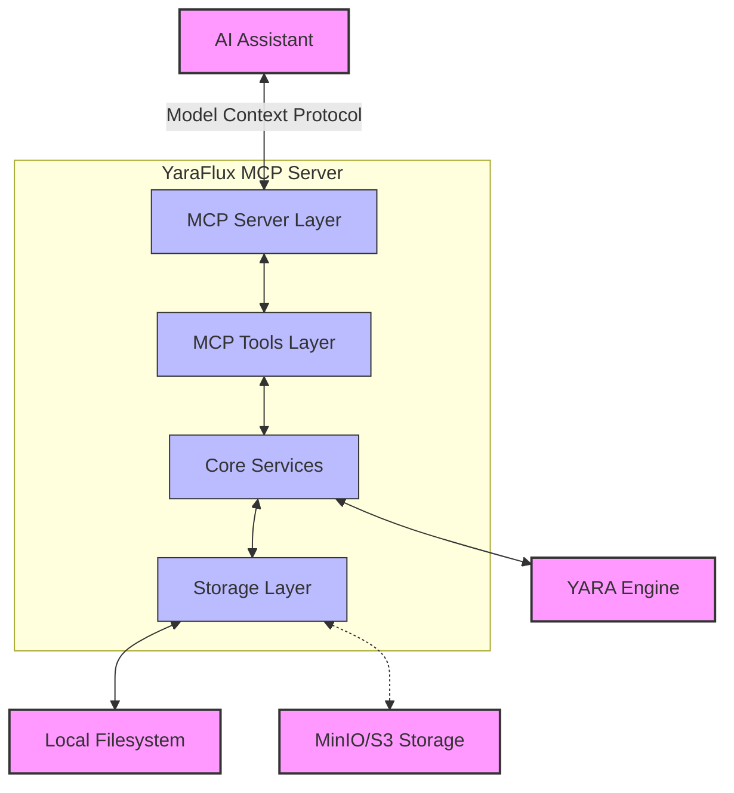
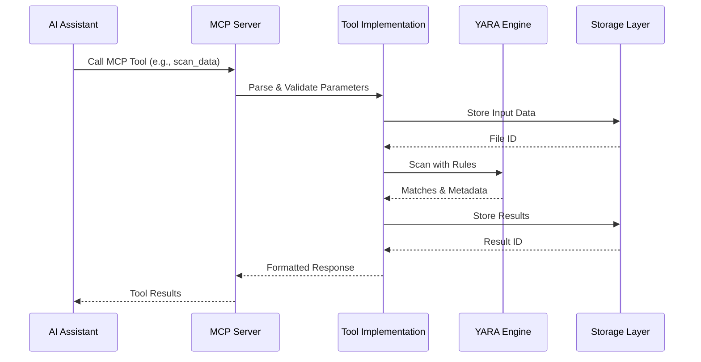

# YaraFlux Documentation

Welcome to the YaraFlux comprehensive documentation. This guide provides detailed information about YaraFlux, a powerful YARA scanning service with Model Context Protocol (MCP) integration designed for AI assistants.

## 🧩 Architecture

YaraFlux implements a modular architecture that separates concerns between different layers:



The architecture consists of these key components:
1. **MCP Server Layer**: Handles communication with AI assistants using the Model Context Protocol
2. **MCP Tools Layer**: Implements functionality exposed to AI assistants
3. **Core Services**: Core functionality for YARA rule management and scanning
4. **Storage Layer**: Abstract storage interface with multiple backends

For detailed architecture diagrams, see [Architecture Diagrams](architecture_diagram.md).

## 📋 Documentation Structure

- [**Architecture Diagrams**](architecture_diagram.md) - Visual representation of system architecture with Mermaid diagrams
- [**Code Analysis**](code_analysis.md) - Detailed code structure, operational architecture, and recommendations
- [**Installation Guide**](installation.md) - Step-by-step setup instructions for different deployment options
- [**CLI Usage Guide**](cli.md) - Command-line interface documentation and examples
- [**API Reference**](api.md) - REST API endpoints, request/response formats, and authentication
- [**YARA Rules Guide**](yara_rules.md) - Creating, managing, and using YARA rules
- [**MCP Integration**](mcp.md) - Model Context Protocol integration details and tool usage
- [**File Management**](file_management.md) - File handling capabilities and storage options
- [**Examples**](examples.md) - Real-world usage examples and workflows

## 🛠️ Available MCP Tools

YaraFlux exposes 19 integrated MCP tools organized into four categories:

### Rule Management Tools
| Tool | Description | Parameters |
|------|-------------|------------|
| `list_yara_rules` | List available YARA rules | `source` (optional): Filter by source |
| `get_yara_rule` | Get a rule's content and metadata | `rule_name`: Name of rule<br>`source`: Rule source |
| `validate_yara_rule` | Validate rule syntax | `content`: YARA rule content |
| `add_yara_rule` | Create a new rule | `name`: Rule name<br>`content`: Rule content<br>`source`: Rule source |
| `update_yara_rule` | Update an existing rule | `name`: Rule name<br>`content`: Updated content<br>`source`: Rule source |
| `delete_yara_rule` | Delete a rule | `name`: Rule name<br>`source`: Rule source |
| `import_threatflux_rules` | Import from ThreatFlux repo | `url` (optional): Repository URL<br>`branch`: Branch name |

### Scanning Tools
| Tool | Description | Parameters |
|------|-------------|------------|
| `scan_url` | Scan URL content | `url`: Target URL<br>`rules` (optional): Rules to use |
| `scan_data` | Scan provided data | `data`: Base64 encoded content<br>`filename`: Source filename<br>`encoding`: Data encoding |
| `get_scan_result` | Get scan results | `scan_id`: ID of previous scan |

### File Management Tools
| Tool | Description | Parameters |
|------|-------------|------------|
| `upload_file` | Upload a file | `data`: File content (Base64)<br>`file_name`: Filename<br>`encoding`: Content encoding |
| `get_file_info` | Get file metadata | `file_id`: ID of uploaded file |
| `list_files` | List uploaded files | `page`: Page number<br>`page_size`: Items per page<br>`sort_desc`: Sort direction |
| `delete_file` | Delete a file | `file_id`: ID of file to delete |
| `extract_strings` | Extract strings | `file_id`: Source file ID<br>`min_length`: Minimum string length<br>`include_unicode`, `include_ascii`: String types |
| `get_hex_view` | Hexadecimal view | `file_id`: Source file ID<br>`offset`: Starting offset<br>`bytes_per_line`: Format option |
| `download_file` | Download a file | `file_id`: ID of file<br>`encoding`: Response encoding |

### Storage Management Tools
| Tool | Description | Parameters |
|------|-------------|------------|
| `get_storage_info` | Storage statistics | No parameters |
| `clean_storage` | Remove old files | `storage_type`: Type to clean<br>`older_than_days`: Age threshold |

## 🚀 Quick Start

### Docker Deployment (Recommended)

```bash
# Clone the repository
git clone https://github.com/ThreatFlux/YaraFlux.git
cd YaraFlux/

# Build the Docker image
docker build -t yaraflux-mcp-server:latest .

# Run the container
docker run -p 8000:8000 \
  -e JWT_SECRET_KEY=your-secret-key \
  -e ADMIN_PASSWORD=your-admin-password \
  -e DEBUG=true \
  yaraflux-mcp-server:latest
```

### Installation from Source

```bash
# Clone the repository
git clone https://github.com/ThreatFlux/YaraFlux.git
cd YaraFlux/

# Install dependencies (requires Python 3.13+)
make install

# Run the server
make run
```

For detailed installation instructions, see the [Installation Guide](installation.md).

## 🔧 Configuration

YaraFlux can be configured using environment variables:

| Variable | Description | Default |
|----------|-------------|---------|
| `JWT_SECRET_KEY` | Secret key for JWT authentication | *Required* |
| `ADMIN_PASSWORD` | Password for admin user | *Required* |
| `DEBUG` | Enable debug mode | `false` |
| `API_HOST` | Host for HTTP server | `0.0.0.0` |
| `API_PORT` | Port for HTTP server | `8000` |
| `STORAGE_TYPE` | Storage backend (`local` or `minio`) | `local` |
| `STORAGE_DIR` | Base directory for local storage | `data` |
| `MINIO_ENDPOINT` | MinIO server endpoint | (for MinIO storage) |
| `MINIO_ACCESS_KEY` | MinIO access key | (for MinIO storage) |
| `MINIO_SECRET_KEY` | MinIO secret key | (for MinIO storage) |
| `MINIO_SECURE` | Use HTTPS for MinIO | (for MinIO storage) |
| `YARA_INCLUDE_DEFAULT_RULES` | Include built-in YARA rules | `true` |

## 🧪 Development

```bash
# Set up development environment
make dev-setup

# Run tests
make test

# Code quality checks
make lint
make format
make security-check

# Generate test coverage report
make coverage

# Run development server
make run
```

## 📊 Data Flow

The following sequence diagram illustrates how data flows through YaraFlux when using an MCP tool:



## 📊 System Requirements

- **Python Version**: 3.13+
- **YARA Version**: 4.2.3+
- **System Libraries**:
  - libmagic (for file type detection)
  - libssl (for HTTPS)
  - libjansson (for YARA JSON support)
- **Docker**: For containerized deployment

For detailed information on each component, please refer to the specific guides listed above.
