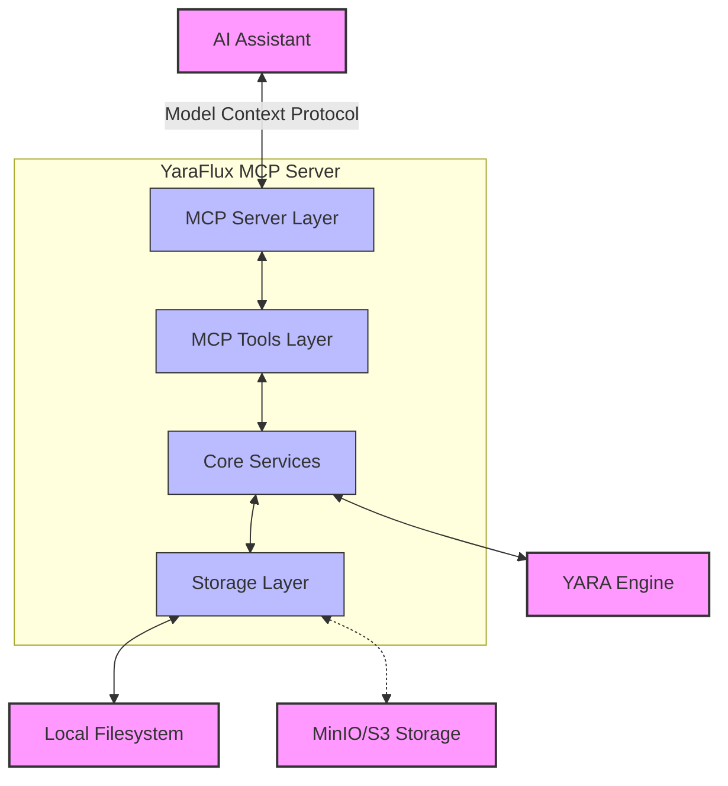
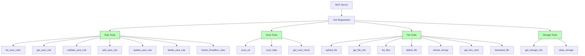
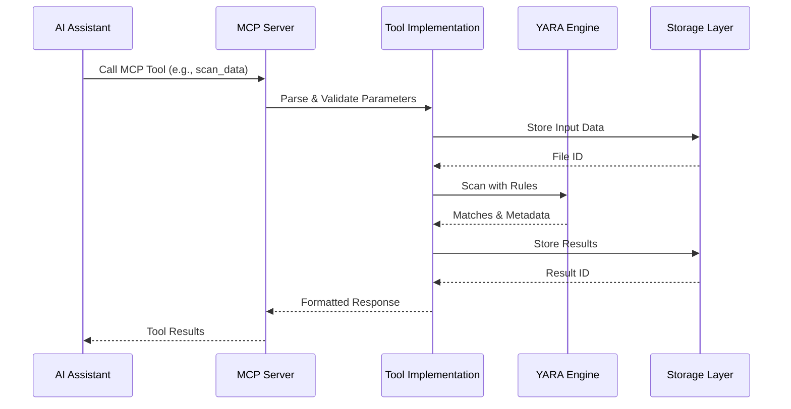
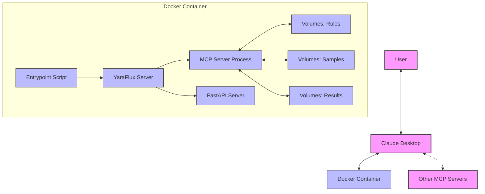
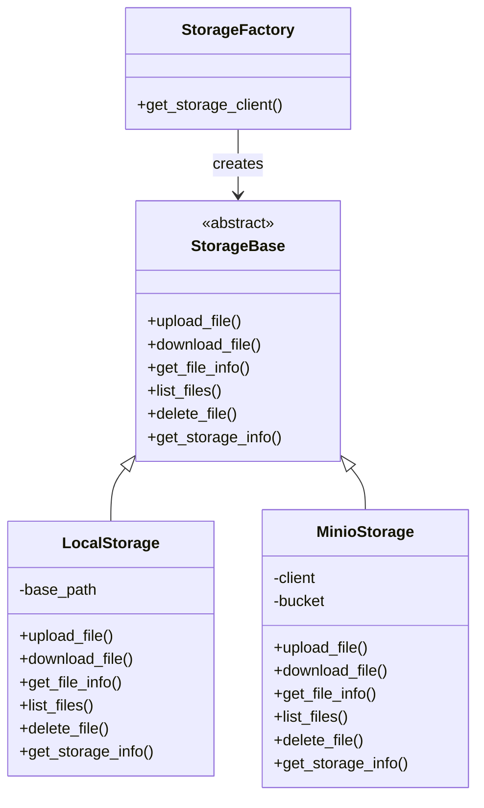

# YaraFlux MCP Server Architecture

The YaraFlux MCP Server implements a modular architecture that exposes YARA scanning functionality through the Model Context Protocol (MCP). This document provides a visual representation of the architecture.

## Overall Architecture

## MCP Tool Structure

## Data Flow

## Deployment View

## Storage Abstraction

This architecture provides a flexible, maintainable system that separates concerns between MCP integration, YARA functionality, and storage operations while ensuring secure, reliable operation in production environments.
