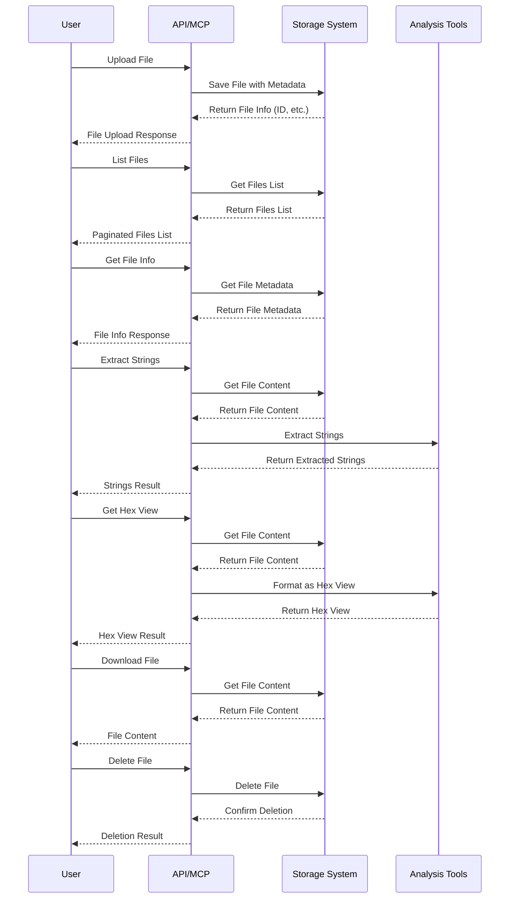

# YaraFlux File Management

This document describes the file management features added to YaraFlux.

## Overview

The file management system in YaraFlux allows you to:

1. Upload files with metadata
2. List and download uploaded files
3. View file details and metadata
4. Analyze file content through string extraction and hex view
5. Manage files (delete, etc.)

## Architecture

The file management system is implemented with the following components:

- **Models** - Data models for file info, upload/download, and analysis
- **Storage Interface** - Abstract base class defining the storage operations
- **Storage Implementations** - Local file system and MinIO (S3-compatible) implementations
- **API Endpoints** - REST API for file operations
- **MCP Tools** - Model Context Protocol tools for Claude integration

```mermaid
graph TD
    User[User/Client] -->|API Requests| Router[Files Router]
    LLM[Claude/LLM] -->|MCP Tools| MCP[MCP Tools]
    
    Router -->|Authentication| Auth[Auth System]
    Router -->|Storage Operations| Storage[Storage Interface]
    MCP -->|Storage Operations| Storage
    
    Storage -->|Implementation| Local[Local Storage]
    Storage -->|Implementation| MinIO[MinIO Storage]
    
    Local -->|Save/Read| FileSystem[File System]
    MinIO -->|Save/Read| S3[S3-Compatible Storage]
    
    subgraph "API Endpoints"
        EP1[POST /upload]
        EP2[GET /info/{file_id}]
        EP3[GET /download/{file_id}]
        EP4[GET /list]
        EP5[DELETE /{file_id}]
        EP6[POST /strings/{file_id}]
        EP7[POST /hex/{file_id}]
    end
    
    subgraph "MCP Tools"
        T1[upload_file]
        T2[get_file_info]
        T3[list_files]
        T4[delete_file]
        T5[extract_strings]
        T6[get_hex_view]
        T7[download_file]
    end
    
    Router --- EP1
    Router --- EP2
    Router --- EP3
    Router --- EP4
    Router --- EP5
    Router --- EP6
    Router --- EP7
    
    MCP --- T1
    MCP --- T2
    MCP --- T3
    MCP --- T4
    MCP --- T5
    MCP --- T6
    MCP --- T7
```

## File Management Workflow



## Usage Examples

### API Usage

```bash
# Upload a file
curl -X POST -F "file=@sample.txt" -H "Authorization: Bearer TOKEN" http://localhost:8000/api/v1/files/upload

# List files
curl -H "Authorization: Bearer TOKEN" http://localhost:8000/api/v1/files/list

# Get file info
curl -H "Authorization: Bearer TOKEN" http://localhost:8000/api/v1/files/info/FILE_ID

# Get hex view
curl -X POST -H "Content-Type: application/json" -H "Authorization: Bearer TOKEN" \
  -d '{"offset": 0, "length": 100, "bytes_per_line": 16}' \
  http://localhost:8000/api/v1/files/hex/FILE_ID
```

### Claude MCP Tool Usage

To upload a file to YaraFlux:

```
upload_file("base64-encoded-data", "example.txt")
```

To get a hexadecimal view of the file contents:

```
get_hex_view("file-id", offset=0, length=100, bytes_per_line=16)
```

To extract strings from the file:

```
extract_strings("file-id", min_length=4, include_unicode=True, include_ascii=True)
