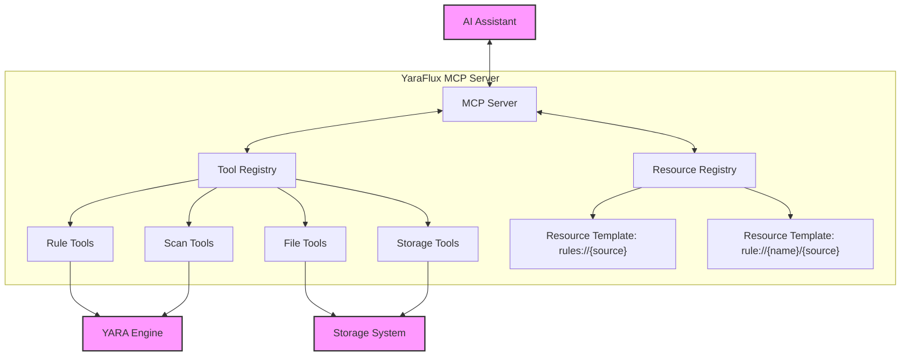
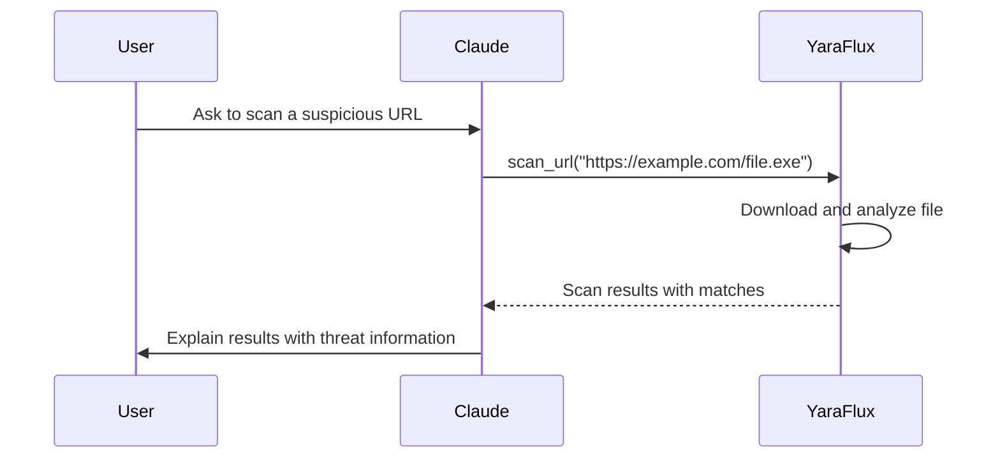
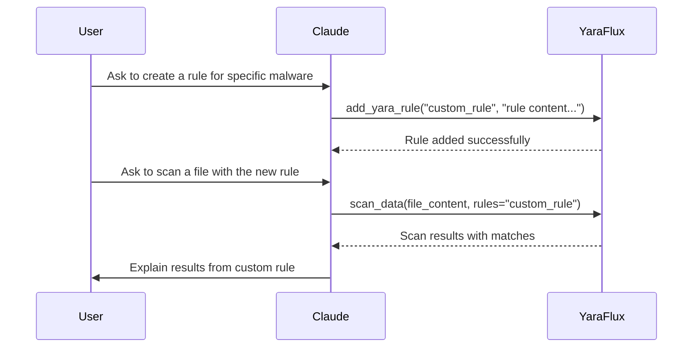
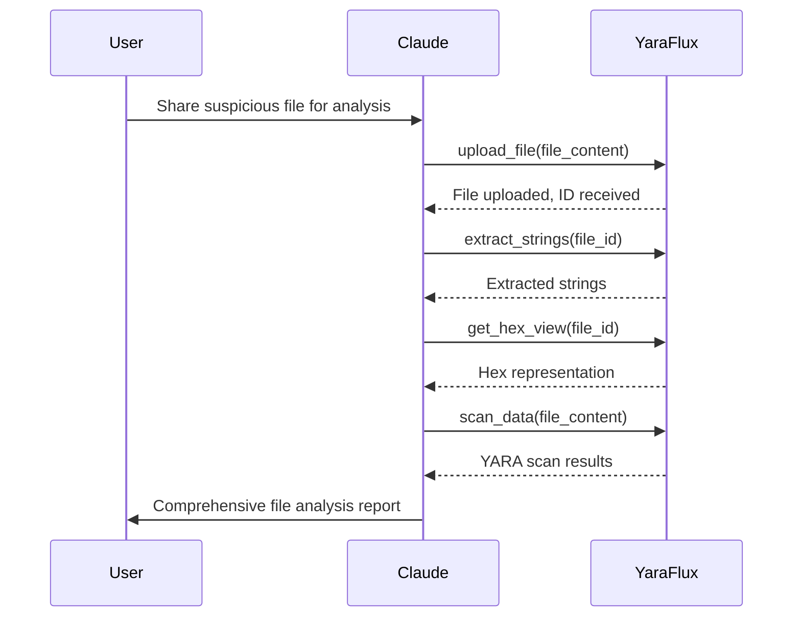

# YaraFlux MCP Integration

This guide provides detailed information about YaraFlux's Model Context Protocol (MCP) integration, available tools, and usage patterns.

## MCP Overview

The Model Context Protocol (MCP) is a standardized protocol for enabling AI assistants to interact with external tools and resources. YaraFlux implements an MCP server that exposes YARA scanning capabilities to AI assistants like Claude.

## Integration Architecture

YaraFlux implements the MCP using the official MCP SDK:



## Available MCP Tools

YaraFlux exposes 19 integrated MCP tools across four functional categories:

### Rule Management Tools

| Tool | Description | Parameters | Result Format |
|------|-------------|------------|--------------|
| `list_yara_rules` | List available YARA rules | `source` (optional): "custom", "community", or "all" | List of rule metadata objects |
| `get_yara_rule` | Get a rule's content and metadata | `rule_name`: Rule file name<br>`source`: "custom" or "community" | Rule content and metadata |
| `validate_yara_rule` | Validate rule syntax | `content`: YARA rule content | Validation result with error details |
| `add_yara_rule` | Create a new rule | `name`: Rule name<br>`content`: Rule content<br>`source`: "custom" or "community" | Success message and metadata |
| `update_yara_rule` | Update an existing rule | `name`: Rule name<br>`content`: Updated content<br>`source`: "custom" or "community" | Success message and metadata |
| `delete_yara_rule` | Delete a rule | `name`: Rule name<br>`source`: "custom" or "community" | Success message |
| `import_threatflux_rules` | Import from ThreatFlux repo | `url` (optional): Repository URL<br>`branch`: Branch name | Import summary |

### Scanning Tools

| Tool | Description | Parameters | Result Format |
|------|-------------|------------|--------------|
| `scan_url` | Scan URL content | `url`: Target URL<br>`rules` (optional): Rules to use | Scan results with matches |
| `scan_data` | Scan provided data | `data`: Base64 encoded content<br>`filename`: Source filename<br>`encoding`: Data encoding | Scan results with matches |
| `get_scan_result` | Get scan results | `scan_id`: ID of previous scan | Detailed scan results |

### File Management Tools

| Tool | Description | Parameters | Result Format |
|------|-------------|------------|--------------|
| `upload_file` | Upload a file | `data`: File content (Base64)<br>`file_name`: Filename<br>`encoding`: Content encoding | File metadata |
| `get_file_info` | Get file metadata | `file_id`: ID of uploaded file | File metadata |
| `list_files` | List uploaded files | `page`: Page number<br>`page_size`: Items per page<br>`sort_desc`: Sort direction | List of file metadata |
| `delete_file` | Delete a file | `file_id`: ID of file to delete | Success message |
| `extract_strings` | Extract strings | `file_id`: Source file ID<br>`min_length`: Minimum string length<br>`include_unicode`, `include_ascii`: String types | Extracted strings |
| `get_hex_view` | Hexadecimal view | `file_id`: Source file ID<br>`offset`: Starting offset<br>`bytes_per_line`: Format option | Formatted hex content |
| `download_file` | Download a file | `file_id`: ID of file<br>`encoding`: Response encoding | File content |

### Storage Management Tools

| Tool | Description | Parameters | Result Format |
|------|-------------|------------|--------------|
| `get_storage_info` | Storage statistics | None | Storage usage statistics |
| `clean_storage` | Remove old files | `storage_type`: Type to clean<br>`older_than_days`: Age threshold | Cleanup results |

## Resource Templates

YaraFlux also provides resource templates for accessing YARA rules:

| Resource Template | Description | Parameters |
|-------------------|-------------|------------|
| `rules://{source}` | List rules in a source | `source`: "custom", "community", or "all" |
| `rule://{name}/{source}` | Get rule content | `name`: Rule name<br>`source`: "custom" or "community" |

## Integration with Claude Desktop

YaraFlux is designed for seamless integration with Claude Desktop:

1. Build the Docker image:
```bash
docker build -t yaraflux-mcp-server:latest .
```

2. Add to Claude Desktop config (`~/Library/Application Support/Claude/claude_desktop_config.json`):
```json
{
  "mcpServers": {
    "yaraflux-mcp-server": {
      "command": "docker",
      "args": [
        "run",
        "-i",
        "--rm",
        "--env",
        "JWT_SECRET_KEY=your-secret-key",
        "--env",
        "ADMIN_PASSWORD=your-admin-password",
        "--env",
        "DEBUG=true",
        "--env",
        "PYTHONUNBUFFERED=1",
        "yaraflux-mcp-server:latest"
      ],
      "disabled": false,
      "autoApprove": [
        "scan_url",
        "scan_data",
        "list_yara_rules",
        "get_yara_rule"
      ]
    }
  }
}
```

3. Restart Claude Desktop to activate the server.

## Example Usage Patterns

### URL Scanning Workflow



### Creating and Using Custom Rules



### File Analysis Workflow



## Parameter Format

When working with YaraFlux through MCP, parameters must be URL-encoded in the `params` field:

```
<use_mcp_tool>
<server_name>yaraflux-mcp-server</server_name>
<tool_name>scan_url</tool_name>
<arguments>
{
  "params": "url=https%3A%2F%2Fexample.com%2Fsuspicious.exe"
}
</arguments>
</use_mcp_tool>
```

## Response Handling

YaraFlux returns consistent response formats for all tools:

1. **Success Response**:
```json
{
  "success": true,
  "result": { ... },  // Tool-specific result data
  "message": "..."    // Optional success message
}
```

2. **Error Response**:
```json
{
  "success": false,
  "message": "Error description",
  "error_type": "ErrorClassName"
}
```

## Security Considerations

When integrating YaraFlux with AI assistants:

1. **Auto-Approve Carefully**: Only auto-approve read-only operations like `list_yara_rules` or `get_yara_rule`
2. **Limit Access**: Restrict access to sensitive operations
3. **Use Strong JWT Secrets**: Set strong JWT_SECRET_KEY values
4. **Consider Resource Limits**: Implement rate limiting for production usage

## Troubleshooting

Common issues and solutions:

1. **Connection Issues**: Check that Docker container is running and MCP configuration is correct
2. **Parameter Errors**: Ensure parameters are properly URL-encoded
3. **File Size Limits**: Large files may be rejected (default max is 10MB)
4. **YARA Compilation Errors**: Check rule syntax when validation fails
5. **Storage Errors**: Ensure storage paths are writable

For persistent issues, check the container logs:
```bash
docker logs <container-id>
```

## Extending MCP Integration

YaraFlux's modular architecture makes it easy to extend with new tools:

1. Create a new tool function in the appropriate module
2. Register the tool with appropriate schema
3. Add the tool to the MCP server initialization

See the [code analysis](code_analysis.md) document for details on the current implementation.
